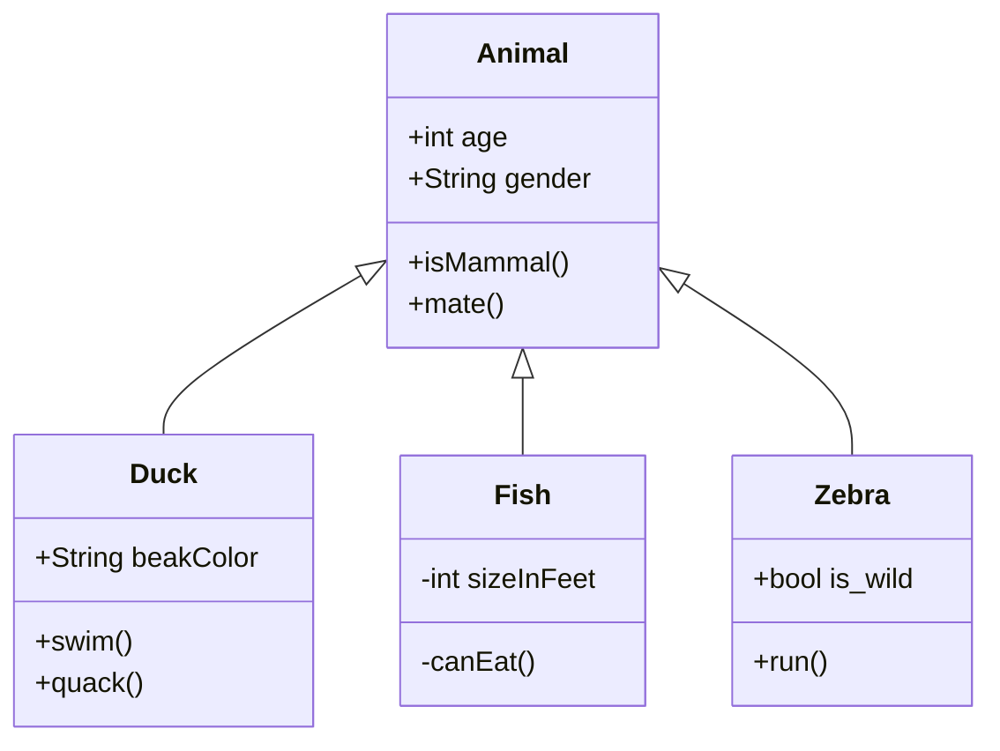
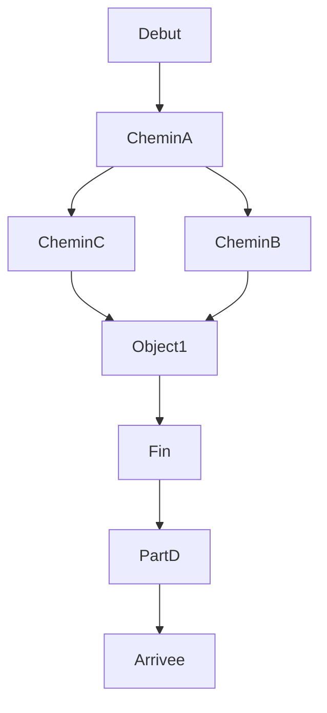

# Deployment diagram
Tags: #deployment #diagram #mermaid 

A **deployment diagram** in the [[Unified Modeling Language]] models the physical deployment of artifacts on nodes.

    
## Class Diagram

## Graph
           

