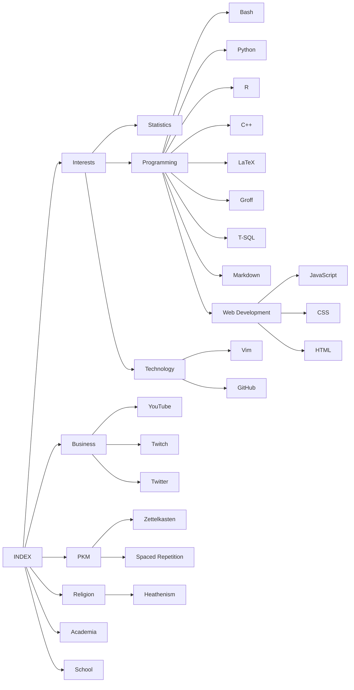

```mermaid
graph LR;
	%%==============%%
	%% Declarations %%
	%%==============%%
		A[INDEX]
			click A INDEX;
		B[Interests]	
			click B Interests;
		C[Statistics]
			click C Statistics;
		D[Programming]
			click D Programming;
		E[Vim]
			click E Vim;
		F[Bash]
			click F Bash;
		G[Python]
			click G Python;
		H[R]
			click H R;
		I[C++]
			click I "C++";
		J[LaTeX]
			click J LaTeX;
		K[Groff]
			click K Groff;
		L[Business]
			click L Business;
		M[YouTube]
			click M YouTube;
		N[PKM]
			click N PKM;
		O[Religion]
			click O Religion;
		P[Heathenism]
			click P Heathenism;
		Q[T-SQL]
			click Q T-SQL;
		R[Markdown]
			click R Markdown;
		S[Twitch]
			click S Twitch;
		T[Twitter]
			click T Twitter;
		U[Zettelkasten]
			click U Zettelkasten;
		V[Spaced Repetition]
			click V "Spaced Repetition";
		W[Technology]
			click W Technology;
		X[GitHub]
			click X GitHub;
		Y[JavaScript]
			click Y JavaScript;
		Z[Web Development]
			click Z "Web Development";
		A1[CSS]
			click A1 CSS;
		B1[HTML]
			click B1 HTML;
		C1[Academia]
			click C1 Academia;
		D1[School]
			click D1 School;
			
		class A,B,C,D,E,F,G,H,I,J,K,L,M,N,O,P,Q,R,S,T,U,V,W,X,Y,Z internal-link;
		class A1,B1,C1,D1 internal-link;
	%%=========%%
	%% Linking %%
	%%=========%%
	%% Index
	A --> B & L & N & O & C1 & D1
		%% Business
		L --> M & S & T
		%% Interests
		B --> C & D & W
			%% Programming
			D --> F & G & H & I & J & K & Q & R & Z
				%% Web Development
					Z --> Y & A1 & B1
			%% Technology
			W --> E & X
		%% PKM
		N --> U & V
		%% Religion
		O --> P
```