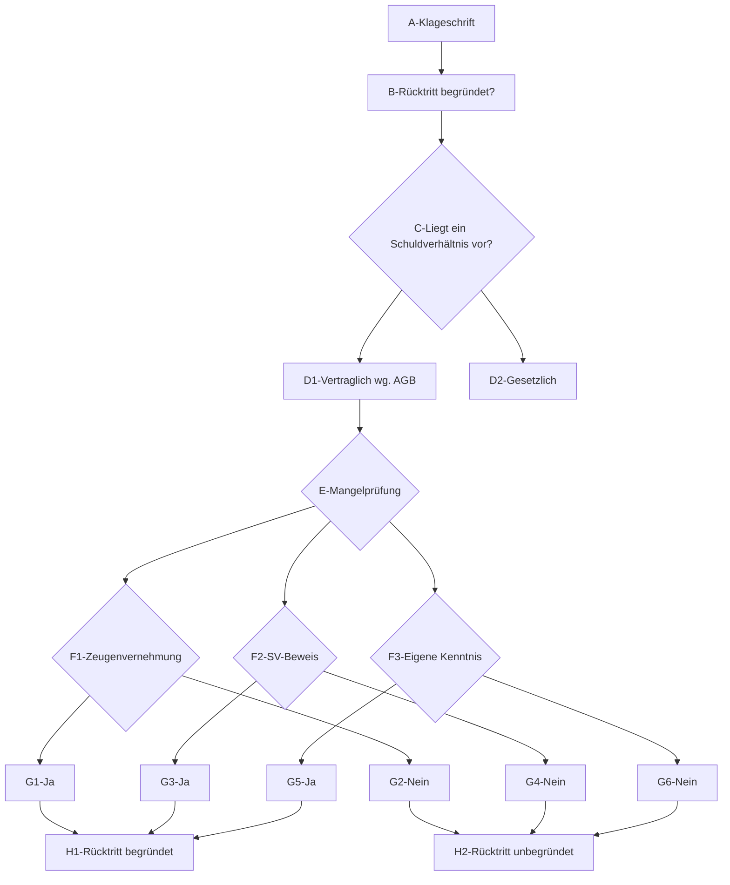

```mermaid
graph TD
A[A-Klageschrift]
A-->B[B-Rücktritt begründet?]
B-->C{C-Liegt ein Schuldverhältnis vor?}
C-->D1[D1-Vertraglich wg. AGB]
C-->D2[D2-Gesetzlich]
D1-->E{E-Mangelprüfung}
E-->F1{F1-Zeugenvernehmung}
E-->F2{F2-SV-Beweis}
E-->F3{F3-Eigene Kenntnis}
F1-->G1[G1-Ja]
F1-->G2[G2-Nein]
F2-->G3[G3-Ja]
F2-->G4[G4-Nein]
F3-->G5[G5-Ja]
F3-->G6[G6-Nein]
G1-->H1[H1-Rücktritt begründet]
G2-->H2[H2-Rücktritt unbegründet]
G3-->H1[H1-Rücktritt begründet]
G4-->H2[H2-Rücktritt unbegründet]
G5-->H1[H1-Rücktritt begründet]
G6-->H2[H2-Rücktritt unbegründet]
```