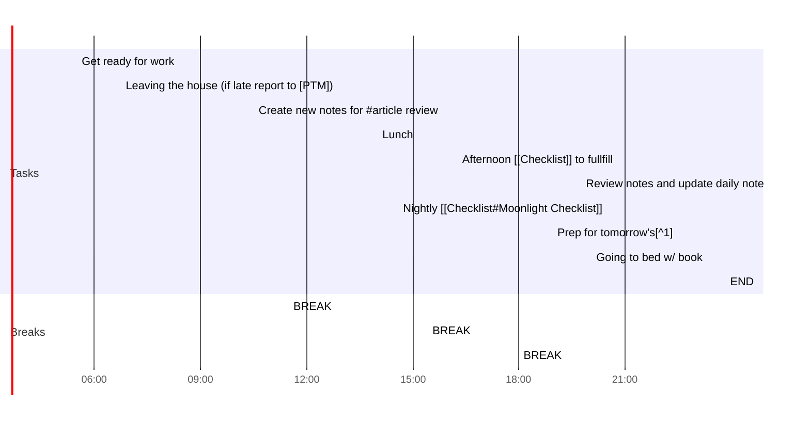

# Daily Notes Mon, 28 12 2020

## Day Planner

- [x] [[Checklist#Morning Checklist]]

## TASKS

- [ ] Review YAML (option)

### Morning Prep

*Coffee and energy drinks are not a "need"...just a "plus"*

- [ ] 05:30 Get ready for work
- [ ] 06:45 Leaving the house (if late report to [PTM])
- [ ] 10:30 Create new notes for #article review
- [ ] 11:30 BREAK

### Midday Lunch

Ideal moment of the day to consider "how well Im sticking to the plan " and how to "win My day"

1. Articles.
2. Book chapters assigned for the day.
3. Re-reading past notes.
   
- [ ] 14:00 Lunch
  - [ ] Article 1 
  - [ ] Article 2
  - [ ] Article notes review
- [ ] 15:25 BREAK

----
- [ ]  **JobCenter** [[high_priority]]  
     - [ ]  Ouvrir le dernier mail recu
     - [ ] Rassembler Document demandes
     - [ ] Creer dossier Jobcenter (correspondance,document )
     - [ ] Envoyer reponse courtoise
----

- [ ] 16:15 Afternoon [[Checklist]] to fullfill
- [ ] 18:00 BREAK

### Daily Review

- [ ] 19:45 Review notes and update daily note
- [ ] 20:30 Nightly [[Checklist#Moonlight Checklist]]
- [ ] 22:30 Prep for tomorrow's[^1]
- [ ] 23:20 Going to bed w/ book
- [ ] 23:50 END

END

## Review

[^1]:22:30 Now,  I write below [[#Review]] my backlog and plan for a better tomorrow !!  🌄🌄🌄🌄🌄