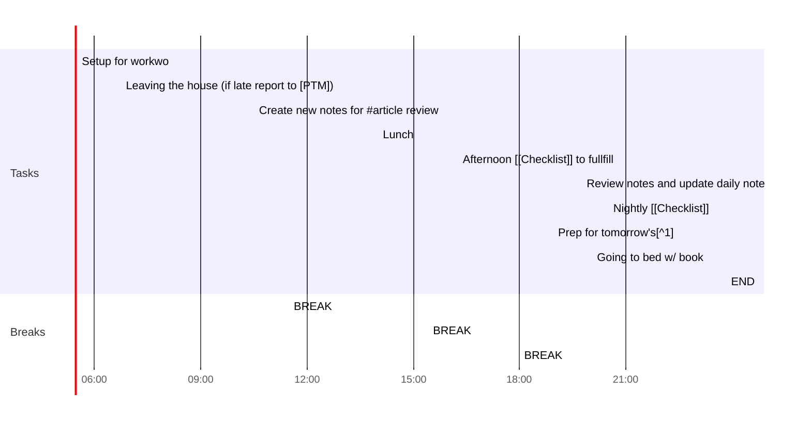

## Day Planner

## Daily Notes Sun, 27 12 2020

### Morning Prep

*Coffee and energy drinks are not a "need"...just a "plus"*

- [ ] 05:30 Setup for workwo
- [ ] 06:45 Leaving the house (if late report to [PTM])
- [ ] 10:30 Create new notes for #article review
- [ ] 11:30 BREAK

### Midday Lunch

Ideal moment of the day to consider "how well Im sticking to the plan " and how to "win My day"

1. Articles.
2. Book chapters assigned for the day.
3. Re-reading past notes.
   
- [ ] 14:00 Lunch
  - [ ] Article 1
  - [ ] Article 2
  - [ ] Article notes review
- [ ] 15:25 BREAK
- [ ] 16:15 Afternoon [[Checklist]] to fullfill
- [ ] 18:00 BREAK

### Daily Review

- 

### Evening 

Time of the day that should be used to reflect on the day and ourself

- [ ] 19:45 Review notes and update daily note
- [ ] 20:30 Nightly [[Checklist]]
- [ ] 22:30 Prep for tomorrow's[^1]
- [ ] 23:20 Going to bed w/ book
- [ ] 23:50 END

## Review
- [ ] Review YAML (moderately)
- [ ] Check Checklist & Tomorrow D.N.

- Clean bathtub
- 

[^1]:22:30 Now,  I write below [[#Review]] my backlog and plan for a better tomorrow !!  🌄🌄🌄🌄🌄

---

# Achievement & TODO 

_**Here is a "draft" summary of my day as I am steadily improving my note-taking skills and until I get to better know my daily routine**_

- [x] Washing clothes
- [x] Cooking dinner
- [ ] Vacuum cleaning the room
- [x] Shave beard
- [x] Peel my feet
- [x] Select tomorrow's clothing 
- [ ] Read chapters from a book  
- [ ] Compose a Template for "End of the Year Best Wishes"[[Template Wishes]]
- [ ] Go to bed on time 