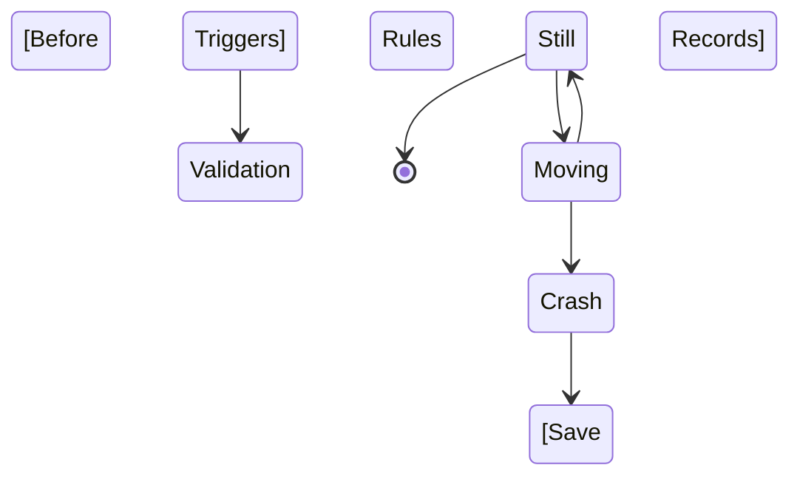

#### Permissions Set Group
Permission Set Groups bundle permission sets together. Users assigned to a permission set group receive the combined permissions of all the permission sets in the group. Permission set groups correspond to the job functions of users. 
- Just like with permission sets, you cannot assign a user to a permission set group if their license does not permit the permissions you want to assign.
  Licensing requirements remain the same when you work with permission set groups.

#### Principle of least privilege
Users should have the least permissions necessary to do their job.
We keep this principle in mind as we work with permission set/groups.

Notes:

Question 6:
What is true regarding queues ?
   - A list view is automatically created when a queue is created for Cases, Leads, or custom objects
   -  Records can be placed in a queue manually or via an assignment rule
    - Custom objects can be assigned to a queue(+Cases, Leads. Orders, Service Contracts, and Knowledge Article Version)

Question 7:

A connecction from Salesforce to an existing cloud application is required. What should an administrator first do when evaluating the level of effort?
   - Search for a connector or app for the application on the AppExchange
> The first step for this type of requirement is to search for a connector for the cloud application on the AppExchange.
>> Lightning Readiness Check

Question 16:
Mr X. has created a joined report in Salesforce and wants to export. In what file formaat would the exported report be?
- .xlsx
Reports in Salesforce can be:
> exported as a Formatted Report oi Details Only.
>> If a report iss exported as Details Only, the file format can be set to either .xls, .xlsx, or .csv
>> Joined reports are always exported as Formatted Reports
&& Formatted Reports are always exported in .xlsx

NB:
- By default, new orgs will have Chatter enabled org-wide for all profiles.
- Salesforce must be contacted to enable a profile-based Chatter rollout to control acess to Chatter at the profile or permission set level.
- Profiles and permission sets can be used to control access to data by specifying the objects that a user can view, edit, and create, but ARE NOT used to share record access

### Export Reports
Reports in Salesforce can be exported as a **Formatted Report** or **Details Only**.
If a report is exported  as Details only, the file  format is either:
- .xls
- .xlsx
- .csv
Joined Reports are always exported as Formatted Reports, and Formatted Reports are _always_ exported in .xlsx

### Order of Execution in Salesforce
![[Pasted image 20220807205958.png]]

### Pipeline Inspection