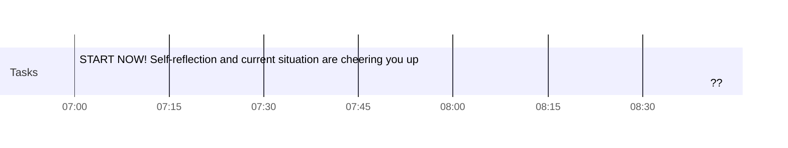

###### Date : 2021-01-29, vendredi 
###### Time : 06:29

{{weather}}

Project name: DiFfrenzZ Kaizen
Topic(s): [List, Knowledge, resources]
Links: 
Tags: ['#kaizen', '#diffrenzz', '#wireframe', '#draft', '#objectives']

# Actions

## Tasks

### Morning

- [x] 07:00 START NOW! Self-reflection and current situation are cheering you up
- [>] 07:25 Enough of reading and structuring/scheduling, WE REACT by either doing something that develops coding skills or apply some principles that are hardly understood otherwise >[[ven., 29 01 2021]] ^task-n3st
- [>] 07:50 The above element should remain the same during this period. >[[ven., 29 01 2021]] ^task-tdou
- [>] 08:15 And this period too. >[[ven., 29 01 2021]] ^task-3x89
- [ ] 08:40 ??
- [>] 09:05 Step 2 >[[ven., 29 01 2021]] ^task-xcqo
- [>] 09:30 Step 3 >[[ven., 29 01 2021]] ^task-2xqf
- [>] 09:55 BREAK >[[ven., 29 01 2021]] ^task-ixw4

### Rest

- [>] 15:00 Review notes and update daily note >[[ven., 29 01 2021]] ^task-8eyb
- [>] 15:45 Walk >[[ven., 29 01 2021]] ^task-skcz
- [>] 16:30 Reading >[[ven., 29 01 2021]] ^task-x6c8
- [>] 17:20 Prep for tomorrow's meetings >[[ven., 29 01 2021]] ^task-n6iu
- [>] 18:00 END >[[ven., 29 01 2021]] ^task-qjoj

### Tutorials
 - [>] Complete Gatsby Tutorials {{today}} >[[ven., 29 01 2021]] ^task-3wiv
 - [>] Complete the TODO-List tutorial on https://reactjs.org >[[ven., 29 01 2021]] ^task-azpe

### Organization

 #### Project Structure & Content
 
  - [>] Decide on wh >[[ven., 29 01 2021]] ^task-z16r

## Day Planner

